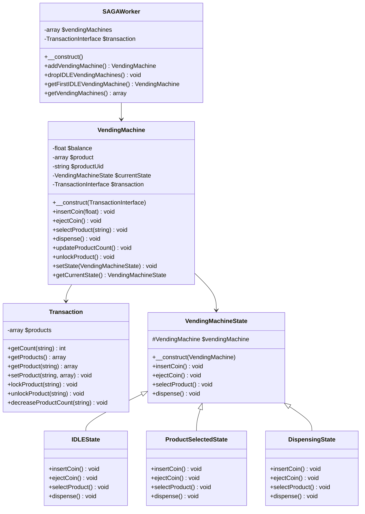
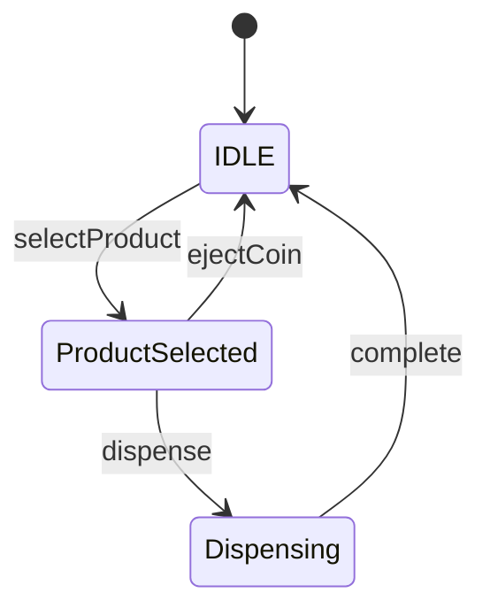

# شماتیک طراحی دستگاه فروش خودکار

## ۱. معماری کلی

این پروژه از الگوی State برای مدیریت وضعیت‌های مختلف دستگاه فروش خودکار استفاده می‌کند. همچنین از الگوی SAGA برای مدیریت تراکنش‌ها استفاده شده است.

### ۱.۱ کلاس‌های اصلی

- `SAGAWorker`: مدیریت دستگاه‌های فروش خودکار
- `VendingMachine`: دستگاه فروش خودکار
- `Transaction`: مدیریت تراکنش‌ها و موجودی محصولات
- `VendingMachineState`: کلاس پایه برای وضعیت‌های دستگاه

### ۱.۲ وضعیت‌های دستگاه

- `IDLEState`: وضعیت آماده به کار
- `ProductSelectedState`: وضعیت انتخاب محصول
- `DispensingState`: وضعیت تحویل محصول

## ۲. نمودار کلاس‌ها

## ۳. نمودار حالت‌ها

## ۴. جریان تراکنش

1. کاربر سکه وارد می‌کند
2. کاربر محصول را انتخاب می‌کند
3. سیستم موجودی و قیمت را بررسی می‌کند
4. در صورت کافی بودن موجودی و قیمت، محصول قفل می‌شود
5. کاربر درخواست تحویل می‌دهد
6. محصول تحویل داده می‌شود و موجودی به‌روز می‌شود
7. قفل محصول آزاد می‌شود

## ۵. مدیریت خطاها

- `ProductNotFound`: محصول یافت نشد
- `NotEnoughCount`: موجودی کافی نیست
- `NotEnoughBalance`: موجودی مالی کافی نیست

## ۶. امنیت

- استفاده از قفل برای جلوگیری از تراکنش‌های همزمان
- بررسی موجودی قبل از قفل کردن محصول
- آزاد کردن قفل در صورت خطا یا لغو تراکنش 